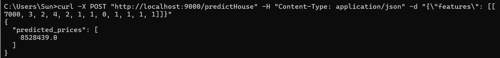
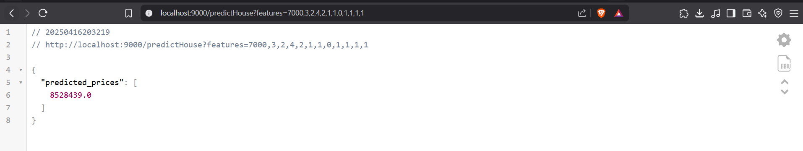

# Housing Price Prediction with XGBoost

## Overview

This project builds a **housing price prediction model** using **XGBoost**, a robust ensemble machine learning algorithm. It utilizes a dataset with various house attributes (e.g., area, bedrooms, amenities) to estimate house prices. The process involves data preprocessing, model training, evaluation, and saving the trained model for deployment.

---

## Training Procedure

### 1. Data Loading & Exploration
- Imported necessary libraries: `pandas`, `numpy`, `sklearn`.
- Loaded dataset `Housing.csv` into a DataFrame (`df`).
- Inspected dataset shape and content.
- Checked for missing values using `df.isnull().any()`.
- Used `.describe()` and `.info()` to explore dataset statistics and types.

---

### 2. Data Cleaning & Preprocessing
- Confirmed absence of null values.
- Applied `LabelEncoder` to `furnishingstatus`.
- Converted categorical variables (`mainroad`, `guestroom`, `basement`, `hotwaterheating`, `airconditioning`, `prefarea`) using `pd.get_dummies()`.

---

### 3. Feature & Target Separation
- Defined features `X` (excluding `price`) and target `y` (`price`).
- Split the data into training and testing sets using `train_test_split` (90% training, 10% testing).

---

### 4.  Model Training (XGBoost)
To train the model, the `XGBRegressor` from the XGBoost library is used. The following parameters are set:

- `n_estimators = 100`: number of boosting rounds
- `learning_rate = 0.1`: step size shrinkage
- `max_depth = 5`: maximum depth of each tree

---

### 5. Model Evaluation
Once the model is trained, it is evaluated on the test set using common regression metrics:

- MAE (Mean Absolute Error): Measures the average magnitude of errors.
- MSE (Mean Squared Error): Measures the average squared difference between predicted and actual values.
- RMSE (Root Mean Squared Error): Square root of MSE, interpretable in the same units as the target variable.
- R² Score (Coefficient of Determination): Indicates how well the model explains the variance in the target variable.
- Evaluation Results
  - MAE: 943,178.62

  - MSE: 1,798,539,132,114.51

  - RMSE: 1,341,096.24

  - R² Score: 0.6129
  - These evaluation values are reasonable given the high magnitude of the target variable (Price), as larger target values naturally lead to proportionally larger error metrics.

# Model Deployment : House Price Prediction API with Docker & Flask

This project deploys a trained machine learning model using **Flask**, **Docker**, and **Docker Compose**. The API exposes an endpoint (`/predictHouse`) that takes house features and returns predicted prices using a pre-trained XGBoost model.

---

##  Docker Setup

### `Dockerfile`

This file defines the Docker image used to run the Flask app.

### `docker-compose.yml`

Defines a service to run the Flask application and map ports/volumes.

## Flask Application

The Flask app loads two pre-trained models (model.pkl and xgb_model.pkl) and exposes multiple endpoints. The relevant endpoint for house price prediction project is /predictHouse, which returns house price predictions based on input features.

### /predictHouse Endpoint

- URL: http://localhost:9000/predictHouse
- Methods: GET, POST
- Input Format 
  - Feature Order : ['area' 'bedrooms' 'bathrooms' 'stories' 'parking' 'furnishingstatus'
 'mainroad_yes' 'guestroom_yes' 'basement_yes' 'hotwaterheating_yes'
 'airconditioning_yes' 'prefarea_yes']
  - POST Method (Command line for windows CLI) : curl -X POST "http://localhost:9000/predictHouse" -H "Content-Type: application/json" -d "{\"features\": [[7000, 3, 2, 4, 2, 1, 1, 0, 1, 1, 1, 1]]}"
  - GET Method (URL for Browser) : http://localhost:9000/predictHouse?features=7000,3,2,4,2,1,1,0,1,1,1,1 
- Example

  
  